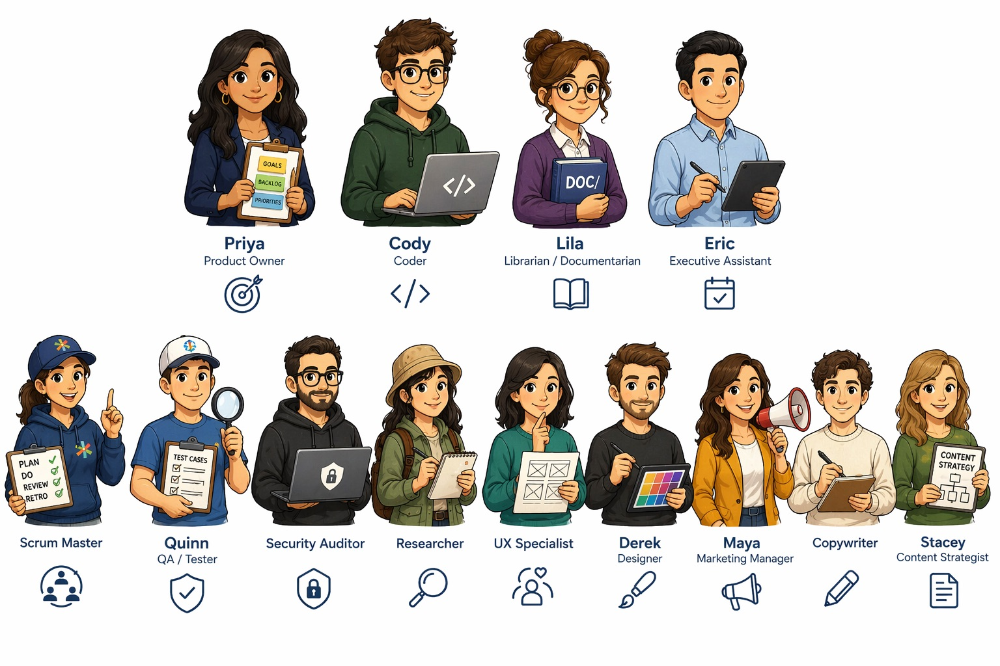

# Agent Management System (AMS)

**Scrum for AI assistants.**

AMS is a lightweight framework for managing AI agents the way we manage human teams — with defined roles, structured handoffs, and just enough process to stay on track without getting in the way.

---

## The Problem

AI agents are powerful but stateless. They forget everything between sessions, can't coordinate across a team, and have no concept of a project's history or direction.

We've solved this before. Agile — and Scrum in particular — exists precisely to coordinate people who are working on complex problems together. The Scrum Guide doesn't say much about coding. It says a lot about communication, roles, and rhythm. Those ideas transfer directly to agents.

---

## How It Works

AMS has three layers:

### 1. The Handoff Protocol

The foundation. A simple convention — a few markdown files in an `AMS/` directory — that gives agents persistent memory across sessions:

- `your-project/`
  - `AMS/`
    - `AGENT.md` — Protocol instructions
    - `HANDOFF/` — Session journals (chronological)
    - `DOC/` — Reference docs (persistent, by topic)

The directory is named `AMS/` by default, but everything is configurable. Rename `AMS/` to `.ams/` if you want it hidden, or to anything else that fits your project. `HANDOFF/` and `DOC/` can be renamed too — if your project already has a `notes/` or `journal/` folder, point AMS at it instead of creating a new one. See `AMS/config.md` for details.

An agent reads `AGENT.md` at the start of each session. It checks `HANDOFF/` for recent context and `DOC/` for project knowledge. At session end, it writes a handoff document so the next session — by any agent, using any tool — picks up where this one left off.

### 2. Personas

Personas are specific AI threads that play defined roles on the project team, the same way a Scrum team has a Product Owner, developers, and a Scrum Master.

Not every project needs every persona. You staff the sprint team from the available pool as the work demands. Multiple instances of the same persona are valid — two coders working in parallel, for instance — when workstreams benefit from separate contexts.

See [Personas.md](Personas.md) for the full roster.

### 3. Sprint Planning & Task Triage

Before a sprint begins, a capable model evaluates the work: breaking tasks into stories, judging complexity, and assigning each task to the most cost-effective model that can handle it. Routine work goes to a lighter model; decisions that require judgment go to a more capable one.

This maps directly onto Scrum's sprint planning ceremony — and it keeps token costs manageable on real projects.

---

## Not Just for Coding

The Scrum Guide doesn't talk much about code. Neither does AMS. The same framework applies to design, content, marketing, research — any knowledge work that benefits from coordinated roles and structured communication.

The persona roster reflects this: alongside coders and architects, there are designers, marketers, content strategists, and a professor who captures what the team learns along the way.

---

## Philosophy

AMS is built on a bias toward simplicity. The best system is the one you'll actually use. Every decision — plain markdown over databases, a plain directory over a separate service, conventions over configuration — reflects that bias.

If you want a more fully-featured pipeline with automated lifecycle management, spec-driven workflows, and kanban visibility, look at [Spec Kitty](https://github.com/Priivacy-ai/spec-kitty) or [Zora](https://github.com/ryaker/zora). AMS is for teams who want to drop something into a project today and go.

---

## What's in This Repo

| Path | Contents |
|---|---|
| [Personas.md](Personas.md) | The full persona roster with roles and descriptions |
| [Tooling.md](Tooling.md) | AMS tools and related projects in the ecosystem |
| [INTERFACE/](INTERFACE/) | Daily Scrum, Office, and Floor Plan HTML interfaces |
| [PERSONAS/](PERSONAS/) | Avatar images (transparent, opaque, and source files) |
| `AMS/` | The Handoff Protocol — copy this into your project to get started |

---

## Related Projects

| Project | What it does |
|---|---|
| [agent-handoff](https://github.com/cellear/agent-handoff) | The Handoff Protocol — standalone, tool-agnostic |
| [agent-handoff-plugin](https://github.com/cellear/agent-handoff-plugin) | Claude Code plugin for `/handoff` setup and session capture |

---

## Getting Started

1. Copy `AMS/` into your project root
2. Tell your agent to read `AMS/AGENT.md`
3. It handles the rest

The directory name, and the names of `HANDOFF/` and `DOC/` inside it, can all be changed to suit your project. See `AMS/config.md`.

Works with any AI assistant. No external services. No account required.

---

## License

MIT — use it however you want.
