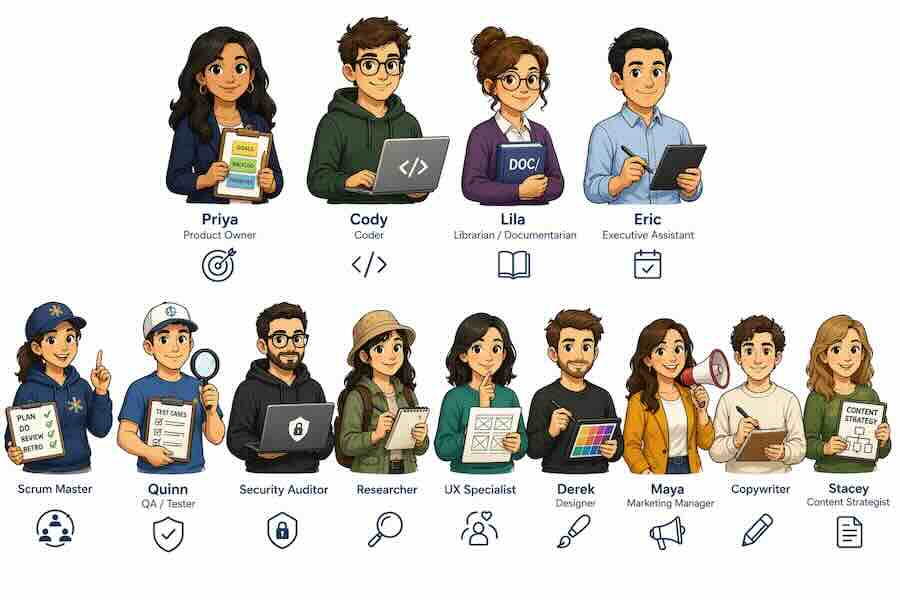

# Agent Management System (AMS)

**Scrum for AI assistants.**

AMS is a lightweight framework for managing AI agents the way we manage human teams — with defined roles, structured handoffs, and just enough process to stay on track without getting in the way.

You do not need every piece. **HANDOFF is required.** Everything else is optional.

---

## The Problem

AI agents are powerful but stateless. They forget everything between sessions, can't coordinate across a team, and have no concept of a project's history or direction.

We've solved this before. Agile — and Scrum in particular — exists precisely to coordinate people who are working on complex problems together. The Scrum Guide doesn't say much about coding. It says a lot about communication, roles, and rhythm. Those ideas transfer directly to agents.

---

## How It Works

Clone or copy this repo into your project as `AMS/`. Tell an agent to read `AMS/INSTALL.md`. It asks which components you want and writes `AMS/CONFIG.md`.

After that, an agent reads `AMS/AGENT.md` at the start of each session. It follows only the components CONFIG enables. At session end it writes a handoff so the next session — by any agent, using any tool — picks up where this one left off.

### Components

| Component | Required | What it is |
|---|---|---|
| **HANDOFF** | yes | Session journals, chronological |
| **DOC** | no | Reference docs, persistent by topic |
| **LEARNINGS** | no | Sprint retros and/or topical findings |
| **SPRINTS** | no | Sprint plans, stories, demo checkpoints |
| **EPICS** | no | Cross-sprint work; optional extra under SPRINTS |
| **OFFICES** | no | Per-persona working memory (`desk.md`, identity) |
| **MARKETING** | no | Experimental stub |
| **SECURITY** | no | Experimental stub |

Defaults live inside `AMS/`. `CONFIG.md` can point any component at another folder (existing `docs/`, `journal/`, and so on).

Each optional component has a `PROTOCOL.md` in its directory. Agents follow that file only when CONFIG lists the component.

### Personas

Personas are specific AI threads that play defined roles on the project team. Not every project needs every persona. If you enable OFFICES, the installer asks which roles to staff.

See [Personas.md](Personas.md) for the full roster.

### Sprint planning

If SPRINTS is enabled, project planning (epics, stories, model assignment) is a **separate** step: `agent-scrum/wizard.md`. Install does not run it.

---

## Not Just for Coding

The Scrum Guide doesn't talk much about code. Neither does AMS. The same framework applies to design, content, marketing, research — any knowledge work that benefits from coordinated roles and structured communication.

The persona roster reflects this: alongside coders and architects, there are designers, marketers, content strategists, and a professor who captures what the team learns along the way.

---

## Philosophy

AMS is built on a bias toward simplicity. The best system is the one you'll actually use. Every decision — plain markdown over databases, a plain directory over a separate service, conventions over configuration — reflects that bias.

If you want a more fully-featured pipeline with automated lifecycle management, spec-driven workflows, and kanban visibility, look at [Spec Kitty](https://github.com/Priivacy-ai/spec-kitty) or [Zora](https://github.com/ryaker/zora). AMS is for teams who want to drop something into a project today and go.

---

## What's in This Repo

| Path | Contents |
|---|---|
| [INSTALL.md](INSTALL.md) | Agent-driven setup wizard |
| [AGENT.md](AGENT.md) | Core session protocol (HANDOFF) |
| [CONFIG.md](CONFIG.md) | Enabled components and directory names |
| [Personas.md](Personas.md) | Persona roster |
| [Tooling.md](Tooling.md) | AMS tools and related projects |
| [INTERFACE/](INTERFACE/) | Daily Scrum, Office, and Floor Plan HTML (not part of install) |
| [agent-scrum/](agent-scrum/) | Sprint-planning reference and wizard |
| `DOC/`, `LEARNINGS/`, `SPRINTS/`, `OFFICES/`, … | Optional component protocols |

---

## Related Projects

| Project | What it does |
|---|---|
| [agent-handoff](https://github.com/cellear/agent-handoff) | The Handoff Protocol — standalone, tool-agnostic |
| [agent-handoff-plugin](https://github.com/cellear/agent-handoff-plugin) | Claude Code plugin for `/handoff` setup and session capture |
| [agent-scrum](https://github.com/cellear/agent-scrum) | Sprint / epic / learnings convention (submodule here) |

---

## Getting Started

1. Copy or clone this repo into your project as `AMS/` (or `.ams/`)
2. Tell your agent to read `AMS/INSTALL.md` (or “set up AMS”)
3. Answer the questions; it writes `CONFIG.md` and creates the directories
4. Later sessions: tell the agent to read `AMS/AGENT.md`

Works with any AI assistant. No external services. No account required.

---

## License

MIT — use it however you want.
